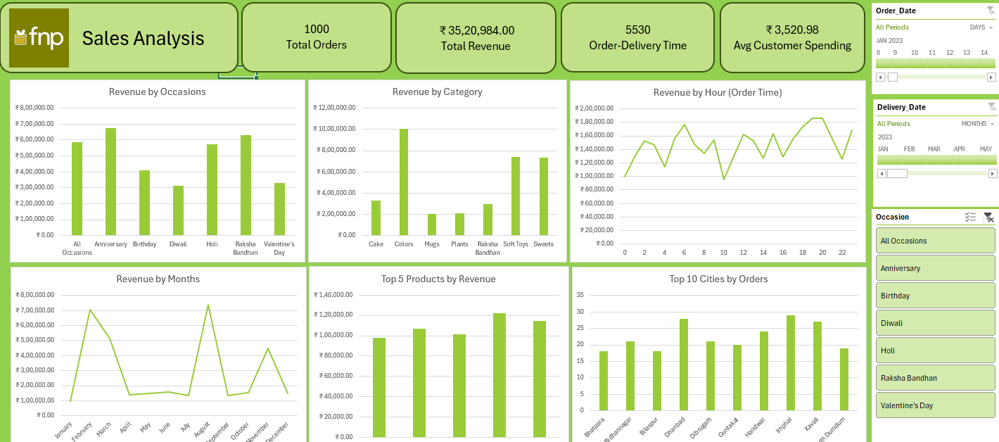

# 📊 Excel Sales Dashboard

An interactive and insightful **Sales Dashboard** built using **Microsoft Excel**, designed to visualize key sales metrics for better decision-making.

---

## 🔍 Project Overview

This project showcases the power of Excel in building visually compelling dashboards without the need for advanced tools or programming. It includes:

- Sales trends over time
- Product/category performance
- Regional breakdown
- KPIs like revenue, profit, units sold
- Slicers for interactivity

---

## 📁 Project Files

- `sales-dashboard.xlsx` — The main Excel dashboard file
- `raw-data` sheet — Contains original sales data
- `pivot-tables` — Used for dynamic reporting
- `charts` — Clean, interactive visuals
- *(Add more file names if needed)*

---

## 🛠 Features

- Clean and modern dashboard layout
- Dynamic charts and pivot tables
- Dropdowns and slicers for filtering
- Conditional formatting to highlight trends

---

## 🧑‍💻 Tools Used

- Microsoft Excel (Pivot Tables, Charts, Formulas)
- Basic Excel functions: `SUMIF`, `VLOOKUP`, `IF`, etc.
- Data cleaning and transformation

---

## 🚀 How to Use

1. Download or clone this repository
2. Open `sales-dashboard.xlsx` in Microsoft Excel
3. Explore the dashboard using slicers and filters
4. Use your own dataset by replacing the raw data

---

## 📌 Use Case

Perfect for:
- Beginners learning Excel dashboards
- Managers needing quick reporting tools
- Data analysts prototyping KPI reports

---

## 🙋‍♀️ Author

**Aaditi**  
GitHub: [aaditi43](https://github.com/aaditi43)

---

## 🌟 Feedback or Suggestions?

Feel free to [open an issue](https://github.com/aaditi43/excel-sales-dashboard/issues) or contact me directly for feedback!

